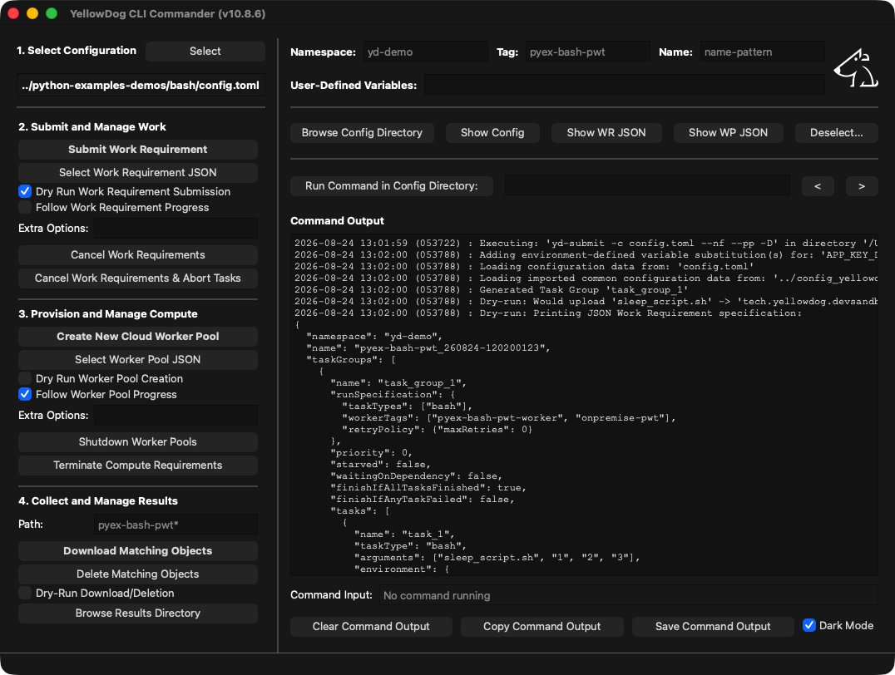

# YellowDog Commander

YellowDog Commander is a cross-platform desktop GUI for driving the YellowDog CLI. It runs on macOS, Windows and Linux, adopting the native look and feel of each platform, and works by invoking the `yd-*` commands on your behalf and showing their output in a command-output window.

Commander is offered as a useful adjunct to the CLI, but is not formally supported.



## Installation

Commander requires the optional `commander` extra (it pulls in PyQt6):

```commandline
pip install -U "yellowdog-cli[commander]"
```

## Running

```commandline
yd-commander
```

Optionally pass a configuration file as the first argument:

```commandline
yd-commander path/to/config.toml
```

Pass `-y`/`--yes` to disable the destructive-action confirmation dialogs for the session (see [A Note on Confirmations](#a-note-on-confirmations)).

Multiple instances can run simultaneously.

## How It Works

Commander does not talk to the YellowDog platform directly. Every action runs one of the `yd-*` commands as a subprocess, in the directory containing the selected configuration file (or the launch directory if none is selected), and streams its output into the **Command Output** window. Commands run asynchronously, so you can start several at once and their output will be interleaved as it arrives.

The full command line for every operation is echoed to the Command Output window before it runs (prefixed with `Executing:`), so you can always see exactly which `yd-*` command and arguments were used.

A configuration file is optional: if none is selected, Commander runs the `yd-*` commands with `--no-config`, sourcing settings from environment variables (`YD_KEY`, `YD_SECRET`, `YD_NAMESPACE`, `YD_TAG`, `YD_URL`) together with the Namespace, Tag, and User-Defined Variables fields described below, and results/downloads are written under the launch directory. Because `--no-config` is passed explicitly, any `config.toml` present in the launch directory is ignored unless you select it — Commander never picks one up implicitly.

## Naming and Matching Assumptions

Commander's bulk management actions — cancelling Work Requirements, terminating Compute Requirements, shutting down Worker Pools, and downloading or deleting objects — do not act on a specific entity you name. Instead they select every entity that matches the current **namespace** and **tag**, so they assume you are using the CLI's default naming convention, in which the tag is embedded in the names, tags, and object paths of the entities you create.

By default that convention holds automatically: when you submit or provision without overriding names, the CLI derives them from the tag. A Work Requirement is named `<tag>_<timestamp>` and tagged with the tag; a Compute Requirement is tagged with the tag; a Worker Pool's name incorporates the tag; and results are written to an object path beginning with the tag. The default namespace is `default` and the default tag is your username, both overridable in the configuration file, by the Namespace and Tag fields, or by environment variables.

Given that convention, the management actions match as follows:

- **Cancel Work Requirements** (`yd-cancel`) — Work Requirements in the namespace whose tag contains the current tag.
- **Terminate Compute Requirements** (`yd-terminate`) — Compute Requirements in the namespace whose tag contains the current tag.
- **Shut Down Worker Pools** (`yd-shutdown`) — Worker Pools in the namespace whose name contains the current tag.
- **Download / Delete Matching Objects** (`yd-download` / `yd-delete`) — objects whose path matches the **Path** field, defaulting to `<tag>*` (objects whose path begins with the current tag).

Matching is by substring or prefix, not exact equality, which has two consequences worth keeping in mind. If you override an entity's name, tag, or object path so that it no longer contains the tag, these actions will not find it. Conversely, a tag that is a substring of another (for example `test` also matches `test2`) will match more entities than you intend. Set the Namespace, Tag, and Path fields deliberately, and use the confirmation dialog's listing of affected items to check exactly what will be acted on before you proceed.

When the default convention does not fit — because you have named entities your own way — the **Name** field is the escape hatch: enter a glob pattern (`*`, `?`, `[…]`) and Cancel Work Requirements, Cancel & Abort, Shut Down Worker Pools, and Terminate Compute Requirements select entities whose **name** matches that pattern within the namespace, instead of matching by tag. A value without wildcards matches the name exactly, so use `*` for partial matches (for example `myproject-*`). The confirmation dialog still lists exactly what the pattern matched before anything is acted on.

### Object Naming and Matching

The **Path** field is the equivalent escape hatch for the object actions, and is more capable than its default suggests. Its value is passed straight through as the remote path argument to `yd-download` / `yd-delete`, so anything those commands accept can be typed into it. Paths are interpreted relative to the `prefix` configured in the `[dataClient]` section of the configuration file (`{{namespace}}/{{tag}}` by default), which is why the default `<tag>*` finds your results: it matches the per-Work-Requirement directories written beneath that prefix, named `<tag>_<timestamp>`. The placeholder text shows the default that will be used if you leave the field blank.

That gives you four ways to widen or narrow the reach of a download or deletion:

- **Wildcards** (`*`, `?`, `[…]`) anywhere in the path, matching files and directories — `<tag>_2607*` for one month's runs, `*` for everything under the prefix. The matched names are listed before anything is downloaded or deleted.
- **A specific file or subdirectory**, with `/` separators — `myproject_260728-104500123/taskoutput.txt` retrieves a single object rather than a whole tree.
- **Variable substitution** with `{{...}}` — the built-in variables (`{{namespace}}`, `{{tag}}`, `{{username}}`, `{{date}}`) and any variable set in the User-Defined Variables field or the configuration file. Unlike on the command line, no quoting is needed: Commander passes the field's contents to the command directly, with no shell in between to expand or mangle them.
- **An absolute rclone path** of the form `<remote>:<bucket>/<path>`, which is used verbatim and bypasses the configured prefix entirely, reaching anywhere the data store profile has access to — including objects that have nothing to do with the current namespace and tag.

The absolute-path form deserves particular care: a path that escapes the configured prefix also escapes the namespace and tag scoping that otherwise limits what these actions can reach, as does a broad wildcard such as `*`. Delete Matching Objects also deletes recursively, so a matched directory goes with everything inside it. The confirmation dialog always lists the objects and top-level directories it matched first, so read it before confirming.

## Selecting a Configuration (Panel 1)

Use the **Select** button to choose a `config.toml` file. The selected path is shown beneath the button, and all subsequent commands run in that file's directory and are passed it via `-c`. If you launched Commander with a file argument, it is pre-selected.

## Submitting and Managing Work (Panel 2)

- **Submit Work Requirement** — runs `yd-submit`. If a Work Requirement definition has been chosen with **Select Work Requirement JSON**, it is submitted; otherwise the definition from the configuration file is used.
- **Select Work Requirement JSON** — pick a Work Requirement definition file (`.json` or `.jsonnet`) to submit. Once a file is selected the button's label becomes `Work Requirement: <filename>`, so you can see at a glance whether a definition is in force; hover for the full path, and use **Deselect Files** to revert to the configuration file's definition.
- **Dry Run Work Requirement Submission** — when ticked, the submission is validated and the generated specification is printed, but nothing is submitted.
- **Follow Work Requirement Progress** — when ticked the command follows the Work Requirement's progress until it concludes.
- **Extra Options** — free-text command-line options appended to the `yd-submit` command.
- **Cancel Work Requirements** — cancels all matching Work Requirements.
- **Cancel Work Requirements & Abort Tasks** — cancels all matching Work Requirements and aborts their running tasks.

## Provisioning and Managing Compute (Panel 3)

- **Create New Cloud Worker Pool** — runs `yd-provision`. If a Worker Pool definition has been chosen with **Select Worker Pool JSON**, it is used; otherwise the definition from the configuration file is used.
- **Select Worker Pool JSON** — pick a Worker Pool definition file (`.json` or `.jsonnet`) to provision. As with the Work Requirement button, the label becomes `Worker Pool: <filename>` while a file is selected.
- **Dry Run Worker Pool Creation** — when ticked, validates and prints the specification without provisioning.
- **Follow Worker Pool Progress** — when ticked, follows the Worker Pool's progress after provisioning.
- **Extra Options** — free-text command-line options appended to the `yd-provision` command.
- **Shutdown Worker Pools** — shuts down all matching Worker Pools.
- **Terminate Compute Requirements** — terminates all matching Compute Requirements.

## Collecting and Managing Results (Panel 4)

- **Path** — the object path to match for download and deletion. If left blank, all objects matching the current tag are used. Wildcards, `{{variable}}` substitution, and absolute rclone paths are all accepted (see [Naming and Matching Assumptions](#naming-and-matching-assumptions)).
- **Download Matching Objects** — downloads all matching objects into a `results` directory alongside the configuration file.
- **Delete Matching Objects** — deletes all matching objects from remote storage.
- **Dry-Run Download/Deletion** — when ticked, reports what would be downloaded or deleted without transferring or removing anything.
- **View Results Directory** — opens the `results` directory in the system file viewer.

## Namespace, Tag, and Name Overrides

The **Namespace** and **Tag** fields override the values from the configuration file for every command. The default values discovered from the configuration are shown as placeholder text, so you can see what will be used if you leave a field blank.

The **Name** field is different in scope: it is a glob pattern applied only to the bulk management actions (Cancel Work Requirements, Cancel & Abort, Shut Down Worker Pools, and Terminate Compute Requirements), selecting entities by name rather than by tag (see [Naming and Matching Assumptions](#naming-and-matching-assumptions)). Leave it blank to keep the default tag-based matching. A single Name field is shared by all four actions, so it applies to whichever one you run.

## User-Defined Variables

The **User-Defined Variables** field passes variables to the commands for substitution in specifications. Enter them as `name=value` pairs separated by spaces, for example:

```text
instances=2 template=my_template
```

Each pair is passed to the command as a `-v` option (`-v instances=2 -v template=my_template`).

## Utility Actions

- **View Config Directory** — opens the configuration file's directory in the system file viewer.
- **Show Configuration** — prints the contents of the selected configuration file to the Command Output window.
- **Show WR** / **Show WP** — display the contents of the Work Requirement / Worker Pool definition file (the file selected in Panel 2 or 3, or the one referenced by the configuration).
- **Deselect Files** — clears any explicitly selected Work Requirement and Worker Pool definition files, reverting to the definitions in the configuration file.
- **Clear Command Output** / **Copy Command Output** — clear the output window, or copy its full contents to the clipboard.
- **Dark Mode** — toggle between light and dark appearance.

## Running Arbitrary Commands

The **Run Command in Config Directory** field runs any command in the configuration file's directory. If the command begins with `yd-`, the selected configuration file, the namespace/tag overrides, and the user-defined variables are added to it automatically (unless you supply your own `-c`/`--config`/`--no-config`). The `<` and `>` buttons step back and forth through your command history.

## Sending Input to a Running Command

If a running command prompts for input, type into the **Command Input** field and press Enter to send a line to the process's standard input.

## A Note on Confirmations

Cancellation (with or without abort), object deletion, Worker Pool shutdown, and Compute Requirement termination act on **all** matching entities and cannot be undone, so each asks for confirmation before running. The confirmation dialog lists the specific items that would be affected — the Work Requirements, Worker Pools, or Compute Requirements, or the objects and top-level directories that would be deleted — determined in advance without changing anything; if nothing matches, Commander reports that in the output window and does nothing rather than showing a dialog. The dialog offers **Yes**, **No**, and **Yes (Don't Ask Again)**; the last confirms and suppresses further prompts for that same action for the rest of the session. Check the namespace, tag, and path you have set before confirming. A real object deletion is confirmed, but a dry-run deletion is not (it changes nothing). Launch with `-y`/`--yes` to disable these confirmation dialogs entirely for the session.
